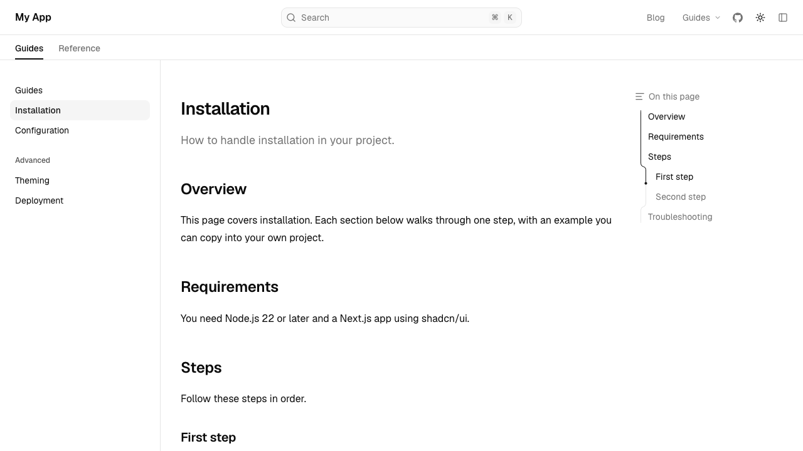
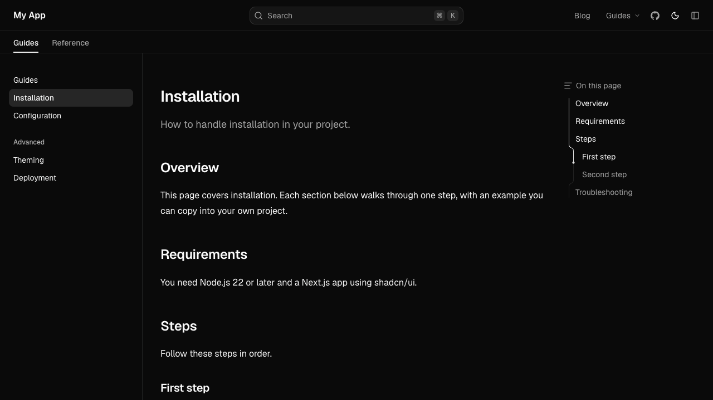

<div className="not-docs-typeset overflow-hidden rounded-xl border dark:hidden">



</div>

<div className="not-docs-typeset hidden overflow-hidden rounded-xl border dark:block">



</div>

## Installation

```npm
npx shadcn@latest add @docscn/notebook-layout @docscn/notebook-page
```

## Usage

The notebook layout has its own `DocsLayout` and `DocsPage`. Import both from `layouts/notebook`:

```tsx title="app/docs/layout.tsx"
import { DocsLayout } from "@/components/docs/layouts/notebook";
import { baseOptions } from "@/lib/layout.shared";
import { source } from "@/lib/source";

export default function Layout({ children }: LayoutProps<"/docs">) {
  const base = baseOptions();

  return (
    <DocsLayout
      {...base}
      tree={source.getPageTree()}
      nav={{ ...base.nav, mode: "top" }}
      tabMode="navbar"
    >
      {children}
    </DocsLayout>
  );
}
```

```tsx title="app/docs/[[...slug]]/page.tsx"
import {
  DocsBody,
  DocsDescription,
  DocsPage,
  DocsTitle,
} from "@/components/docs/layouts/notebook/page";
```

The page components take the same props as [`DocsPage`](/docs/components/docs-page) and its companions, so switching layouts means changing `layouts/docs` to `layouts/notebook` in both imports.

Like [`DocsLayout`](/docs/components/docs-layout), it's built on the shadcn/ui sidebar, so `useSidebar()` works inside it. Unlike it, the navbar shows on desktop too, with search, the links and the theme switch. When the sidebar is collapsed, the navbar shows the title and a button to open the sidebar again.

The layout spans the full width of the window, with the sidebar against its edge. Fumadocs UI's notebook layout is centred at up to 97rem wide.

The [AI chat](/docs/components/docs-layout#ai-chat) panel (`aiChat`) works as in `DocsLayout`. With `nav.mode: "top"`, it docks below the navbar.

## Props

It takes the same props as [`DocsLayout`](/docs/components/docs-layout), except for the ones below.

<TypeTable
  type={{
    nav: {
      description: (
        <>
          As for <code>{"DocsLayout"}</code>, plus <code>{"mode"}</code>:{" "}
          <code>{"top"}</code> places the navbar above the sidebar, across the
          whole width, and <code>{"auto"}</code> places it beside the sidebar.
        </>
      ),
      type: 'NavOptions & { mode?: "top" | "auto" }',
      default: '{ mode: "auto" }',
    },
    links: {
      description: (
        <>
          Links shown in the navbar from the <code>{"lg"}</code> breakpoint, and
          in the sidebar below it. <code>{'type: "menu"'}</code> links open a
          menu on hover.
        </>
      ),
      type: "LinkItemType[]",
    },
    tabMode: {
      description: (
        <>
          Show layout tabs as a dropdown in the sidebar (
          <code>{"sidebar"}</code>), or as a row below the navbar from the{" "}
          <code>{"lg"}</code> breakpoint (<code>{"navbar"}</code>).
        </>
      ),
      type: '"sidebar" | "navbar"',
      default: '"sidebar"',
    },
    themeSwitch: {
      description: (
        <>The theme switch, in the navbar, or the sidebar on mobile.</>
      ),
      type: "{ enabled?, mode? }",
    },
    containerProps: {
      description: (
        <>Props for the element that wraps the navbar, sidebar and page.</>
      ),
      type: 'ComponentProps<"div">',
    },
  }}
/>

`sidebar` takes the same options as `DocsLayout`'s, except `enabled`: the notebook layout always has a sidebar. Search shows in the navbar, not the sidebar.
